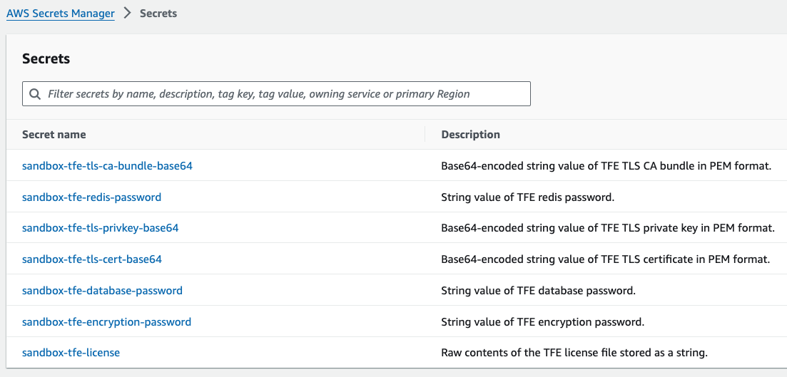

# TFE "Bootstrap" Secrets

Below is a table and example screenshot of the TFE _bootstrap_ secrets stored in AWS Secrets Manager that this module requires to fully automate the deployment and installation of TFE on AWS (VM + Container).

| Secret                                           | Secret Type      | Module Input                         |
|--------------------------------------------------|------------------|--------------------------------------|
| TFE license file                                 | Plaintext secret | `tfe_license_secret_arn`             |
| TFE encryption password                          | Plaintext secret | `tfe_encryption_password_secret_arn` |    
| TFE database password                            | Plaintext secret | `tfe_database_password_secret_arn`   |
| TFE Redis password                               | Plaintext secret | `tfe_redis_password_secret_arn`      |
| TFE TLS certificate (base64-encoded)             | Plaintext secret | `tfe_tls_cert_secret_arn`            |
| TFE TLS certificate private key (base64-encoded) | Plaintext secret | `tfe_tls_privkey_secret_arn`         |
| TFE TLS CA bundle (base64-encoded)               | Plaintext secret | `tfe_tls_ca_bundle_secret_arn`       |

## Formatting

### TFE license file

- This value should be the raw contents of your TFE license file

Example:

```shell
cat terraform.hclic
```

### TFE encryption password

- This value should be randomly generated characters
- Special characters are OK to use here

### TFE database password

- This value should be randomly generated characters between 8 and 128 characters in length
- Special characters are OK to use here, except for the '@', '\"', or '/' characters

### TFE redis password

- This value should be randomly generated characters between 16 and 128 characters in length
- Special characters are OK to use here, except for the '@', '\"', or '/' characters

### TFE TLS certificates

- Start off with your certificate files in PEM format
- These values should be base64-encoded
- Ensure your command line interface (CLI) does not automatically inject new line characters during the base64-encoding

Example on macOS Terminal:

```shell
cat tfe_cert.pem | base64
cat tfe_privkey.pem | base64
cat tfe_ca_bundle.pem | base64
```

Example on Linux Bash shell:

```shell
cat tfe_cert.pem | base64 -w 0
cat tfe_privkey.pem | base64 -w 0
cat tfe_ca_bundle.pem | base64 -w 0
```

## Example Screenshot

